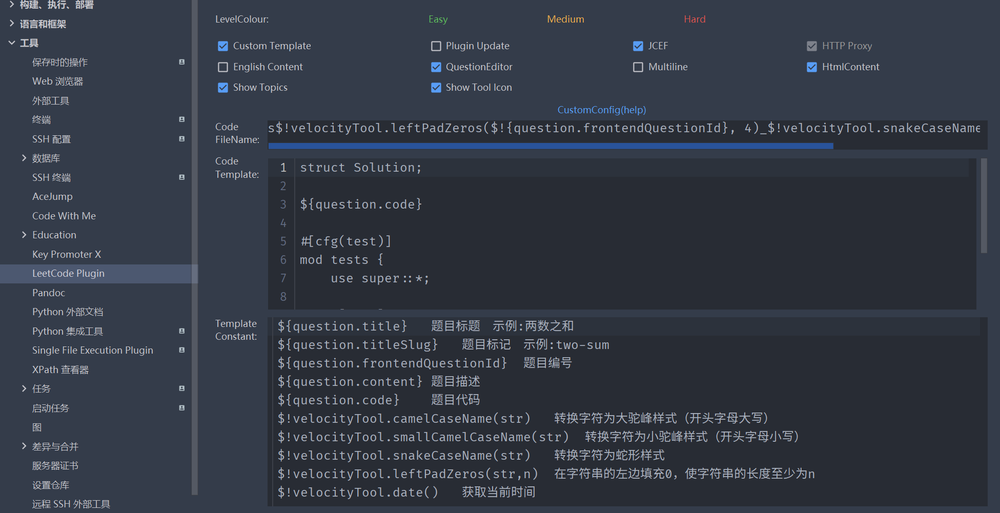

# LeetCode-Rust

用 CLion 刷 LeetCode，插件用自己改过的 [leetcode-editor](https://github.com/Latias94/leetcode-editor/releases) ，这样题目会直接生成在路径下，没有额外的文件夹结构。

## 插件设置



```
s$!velocityTool.leftPadZeros($!{question.frontendQuestionId}, 4)_$!velocityTool.snakeCaseName(${question.titleSlug})
```

```rust
struct Solution;

${question.code}

#[cfg(test)]
mod tests {
    use super::*;
    // use rustgym_util::*;

    #[test]
    fn test() {
        
    }
}
```